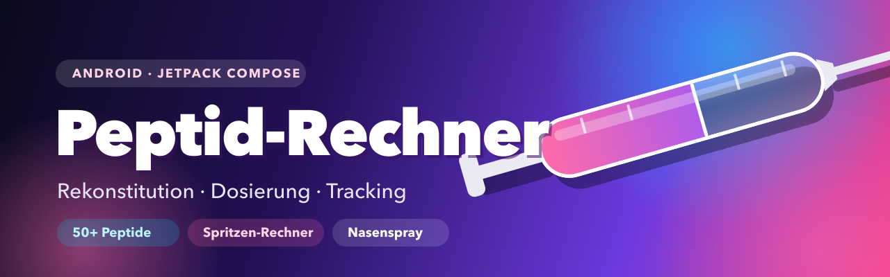
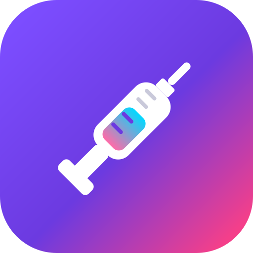
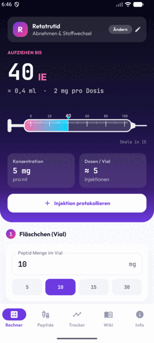
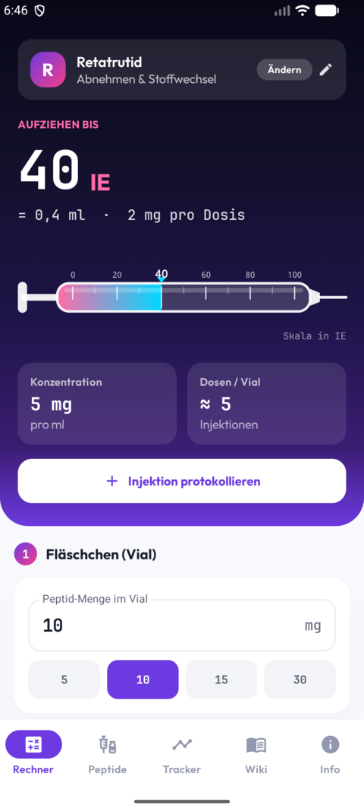
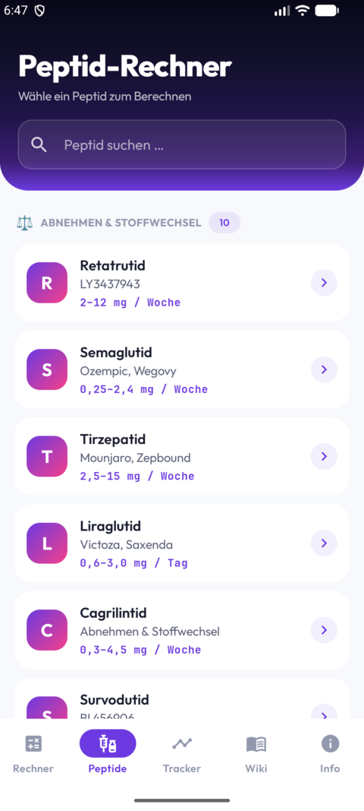
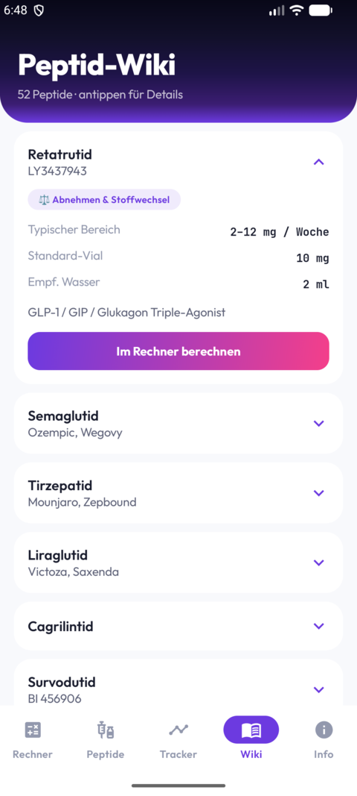
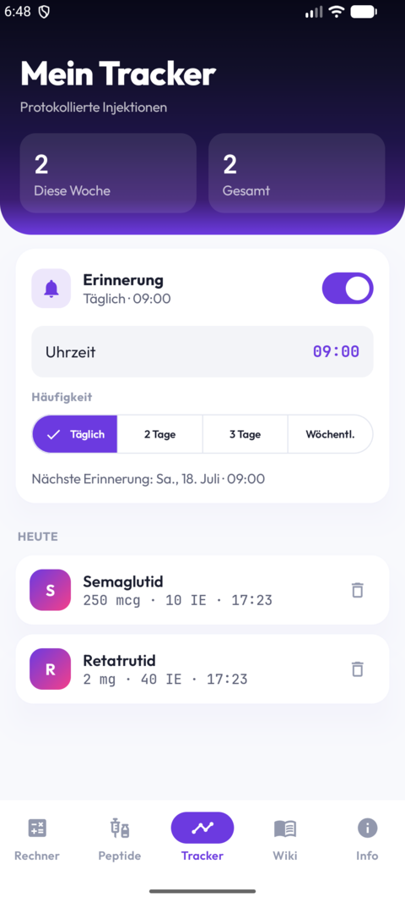

<p align="center">
  
</p>

<p align="center">
  <br>
  <b>Peptid-Rechner</b><br>
  <i>Moderner Android-Rechner für die Rekonstitution & Dosierung von Peptiden</i>
</p>

<p align="center">
  
  
  
  
</p>

---

Der Nutzer wählt ein Peptid aus einer Liste, gibt Vial-Größe, Wassermenge und
gewünschte Dosis ein – die App zeigt sofort, bis zu welcher **Einheiten-Markierung
(IE)** auf einer Insulinspritze aufgezogen werden muss.

Gebaut mit **Kotlin + Jetpack Compose + Material 3** (Androids modernes,
SwiftUI-artiges UI-Framework): dunkler Lila-Verlaufs-Hero, Primär-Lila `#6C3AE0`
mit Pink-Akzent `#F43F8A`, glasige weiße Cards mit lila-getönten Schatten, Fonts
**Outfit** (UI) + **JetBrains Mono** (Zahlen), animierte Spritzen-Visualisierung.

## 🎬 So funktioniert die App

<p align="center">
  
</p>

## 📱 Screenshots

| Rechner | Peptide | Wiki | Tracker & Erinnerung |
|:---:|:---:|:---:|:---:|
|  |  |  |  |

## Navigation (Bottom-Tabs)

- **Rechner** – Live-Rechner mit ausgewähltem Peptid, großem Ergebnis-Hero + Button „Injektion protokollieren".
- **Peptide** – durchsuchbare Liste, gruppiert nach Kategorie; Auswahl öffnet den Rechner.
- **Tracker** – protokollierte Injektionen mit Statistik (Diese Woche / Gesamt), nach Tag gruppiert, einzeln löschbar. Lokal auf dem Gerät gespeichert (SharedPreferences + JSON), bleibt nach Neustart erhalten. Enthält oben die **Erinnerungs-Karte**: Schalter, Uhrzeit, Häufigkeit (täglich / alle 2–3 Tage / wöchentlich). Plant eine lokale Benachrichtigung via `AlarmManager`, fragt auf Android 13+ die Benachrichtigungs-Berechtigung ab und stellt sich nach Geräteneustart wieder her (BootReceiver).
- **Wiki** – ausklappbare Info-Karten pro Peptid + „Im Rechner berechnen".
- **Info** – Formel-Erklärung, U-100-Erklärung, **BAC-Wasser-Guide**, **Kaufberatung „Welche Spritze kaufen?"** (Größe, Nadelstärke/Gauge, Nadellänge – aus Community-Empfehlungen recherchiert), rechtlicher Hinweis.

**Weitere Funktionen im Rechner:**
- **BAC-Wasser-Empfehlung pro Peptid** – unter dem Wasser-Feld wird der hinterlegte Richtwert samt resultierender Konzentration angezeigt.
- **Nasenspray-Karte** – bei nasal-tauglichen Peptiden (Semax, Selank, PT-141): berechnet mcg pro Sprühstoß (~0,1 ml) und Anzahl Sprühstöße für die Zieldosis, plus Misch-Anleitung.
- **Spritzen-Grafik** mit echter IE-Zahlenskala (Strich unter jeder Zahl), Zeiger auf den berechneten Füllstand, Farbverlauf.

## Funktionen

- **~50 Peptide** in 7 Kategorien (Abnehmen/GLP-1, Heilung, Wachstumshormon,
  Kosmetik, Kognitiv, Sexuelle Gesundheit, Longevity) – angelehnt an peptidwiki.de.
- **Suche** über Name, Handelsname und Kategorie.
- **Live-Rechner** mit sinnvollen Voreinstellungen pro Peptid und Schnellauswahl-Chips.
- Ergebnis in **IE und ml**, plus Konzentration und Anzahl Dosen pro Vial.
- **Klartext-Anleitung** ("So gehst du vor") in einfachen Schritten.
- Warnung, wenn die Dosis nicht in die gewählte Spritze passt.
- mcg/mg-Umschaltung, drei Spritzengrößen (0,3 / 0,5 / 1,0 ml, U-100).

## Rechenformel

```
Konzentration (mcg/ml) = Vial-Menge (mg) × 1000 ÷ Wasser (ml)
Volumen (ml)           = Dosis (mcg) ÷ Konzentration
Einheiten (IE, U-100)  = Volumen (ml) × 100
Dosen pro Vial         = Vial-Menge (mcg) ÷ Dosis (mcg)
```

Beispiel (Retatrutid): 10 mg Vial + 2 ml Wasser, Dosis 2 mg
→ 5 mg/ml → 0,4 ml → **40 IE**, ~5 Dosen pro Vial.

## Bauen & Installieren

Voraussetzungen: Android Studio (oder Android SDK) + JDK 17.

```bash
# Debug-APK bauen
./gradlew :app:assembleDebug

# Auf angeschlossenem Gerät/Emulator installieren
adb install -r app/build/outputs/apk/debug/app-debug.apk
```

Oder das Projekt einfach in **Android Studio** öffnen und auf ▶ Run drücken.

Die fertige APK liegt unter:
`app/build/outputs/apk/debug/app-debug.apk`

## Neues Peptid hinzufügen

Einfach einen Eintrag in `PeptideRepository.kt` ergänzen:

```kotlin
Peptide("Name", "Handelsname", KATEGORIE, defaultVialMg, defaultWaterMl,
        defaultDose, DoseUnit.MCG, "Typischer Bereich")
```

## Rechtlicher Hinweis

Reines Rechen-/Bildungswerkzeug, **keine medizinische Beratung**. Peptide sind
teils nicht als Arzneimittel zugelassen. Vor jeder Anwendung medizinisches
Fachpersonal konsultieren.

## Lizenz

Veröffentlicht unter der [MIT-Lizenz](LICENSE).
